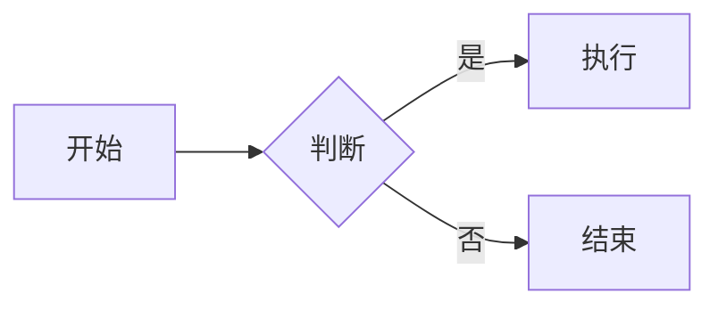

# Blog

极简静态博客。纯 HTML/CSS/JS，无构建工具，无依赖安装。

## 目录结构

```
blog/
├── index.html          # 首页（文章列表 + 标签筛选）
├── post.html           # 文章详情页
├── css/style.css       # 样式
├── js/
│   ├── app.js          # 首页逻辑
│   ├── post.js         # 文章渲染逻辑
│   └── vendor/         # CDN 离线回退（内网部署时使用）
│       ├── marked.min.js
│       ├── katex.min.js
│       ├── auto-render.min.js
│       ├── mermaid.min.js
│       └── prism*.min.js
├── editor/             # 网页编辑器
│   ├── write.html      # 写文章页面
│   ├── index.html      # 文章管理页面
│   └── js/
│       ├── github.js   # GitHub API 封装
│       ├── write.js    # 编辑器逻辑
│       └── manage.js   # 管理页逻辑
├── favicon.svg
└── README.md
```

## 功能

- Markdown 写作，支持代码高亮（Prism.js）、数学公式（KaTeX）、图表（Mermaid）
- Tag 标签筛选
- 暗色主题，响应式布局
- 网页编辑器，一键发布到 GitHub Pages

## 写新文章

### 方式一：网页编辑器（推荐）

1. 本地打开 `editor/editor.html`
2. 输入 GitHub Fine-grained Personal Access Token（需 Contents: Read and write 权限）
3. 填写标题、标签、摘要，写 Markdown 正文
4. 点击「发布」— 自动提交到 GitHub 仓库，GitHub Pages 自动重新部署

### 方式二：命令行

```bash
cp editor/posts/_example.md editor/posts/my-post.md
# 编辑 my-post.md
./editor/new-post.sh editor/posts/my-post.md
git add site/js/posts.js && git commit -m "add post" && git push
```

## 部署

`site/` 目录即为完整的静态站点，推送到 GitHub 后在 Settings → Pages 中选择 `main` 分支的 `/site` 目录作为源。

## 依赖（CDN）

- [marked.js](https://github.com/markedjs/marked) — Markdown 解析
- [KaTeX](https://katex.org) — 数学公式渲染
- [Mermaid](https://mermaid.js.org) — 流程图、时序图等图表渲染
- [Prism.js](https://prismjs.com) — 代码语法高亮
- [JetBrains Mono](https://fonts.google.com/specimen/JetBrains+Mono) + [Inter](https://fonts.google.com/specimen/Inter) — 字体

全部通过 CDN 加载，无需安装。

### CDN 离线回退

每个 CDN `<script>` 标签后都有一个检测脚本：如果 CDN 加载失败（`typeof` 检查全局变量为 `undefined`），会通过 `document.write` 注入本地 `js/vendor/` 下的备份文件。`document.write` 是同步的，保证回退脚本在后续脚本执行前加载完成。

内网部署时，只要把 `js/vendor/` 目录一起部署即可，无需联网。

### 为什么不使用 ES Module Import Map

```html
<!-- 看起来很美好，但实际上有诸多限制 -->
<script type="importmap">
{ "imports": { "katex": "https://cdn.jsdelivr.net/npm/katex/+esm" } }
</script>
<script type="module">
  import katex from 'katex';  // 只在 module 作用域内可用
</script>
```

1. **兼容性要求高**：Import Map 需要 Chrome 89+、Firefox 108+、Safari 16.4+，不支持旧浏览器
2. **改造量大**：所有依赖库必须改用 `import` 语法，全局变量（`window.katex`、`window.marked`）全部失效，第三方库的插件（如 KaTeX auto-render、Prism 组件）也需要改写
3. **作用域隔离**：`import` 的变量只在 `<script type="module">` 内部可用，HTML 中的 `onclick` 等内联事件无法访问
4. **回退更复杂**：`<script type="module">` 不支持 `document.write`，回退需要用动态 `import()` + 错误捕获，时序控制困难

简单说：Import Map 是未来的方向，但需要整个项目从设计上就采用模块化架构，对这种"全局脚本 + CDN"的小项目来说改造成本远大于收益。

## 数学公式渲染原理

KaTeX 和 marked.js 之间存在冲突：marked 会先解析 Markdown，把 `_` 转成 `<em>`（斜体）、`\` 当转义符吞掉、`[]` 当链接语法处理，导致 LaTeX 语法被破坏，KaTeX 无法识别。

例如 `\int_{0}^{\infty}` 中的 `_` 会被 marked 转成 `<em>` 标签，LaTeX 就废了。

解决方式是 **占位符替换**：在 marked 解析之前，用正则把所有数学公式（`$$...$$`、`\[...\]`、`$...$`、`\(...\)`）提取出来，替换成 `%%MATH0%%`、`%%MATH1%%` 这样的占位符；marked 解析完 HTML 后，再把占位符换回原始 LaTeX，最后交给 KaTeX 渲染。这样两边互不干扰。

## 支持的数学公式格式

- 行内公式：`$...$` 或 `\(...\)`
- 块级公式：`$$...$$` 或 `\[...\]`

## Mermaid 图表

在 Markdown 中使用 `mermaid` 代码块即可渲染图表：

````markdown

````
